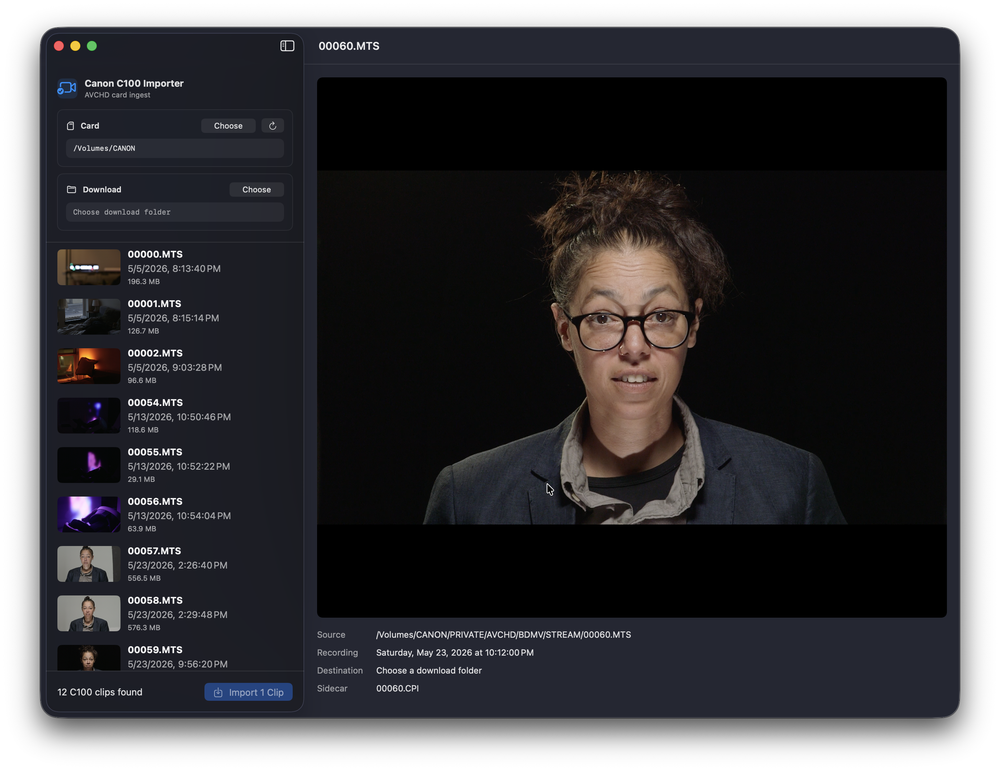

# Canon C100 Import Utility

Native macOS utility for importing, previewing, renaming, organizing, and validating Canon C100 AVCHD media from SD cards.

Canon previously offered a Data Import Utility for the C100-era workflow, but that software is no longer available from Canon/Pixela. This project is an unofficial replacement focused on the Canon C100 card structure and modern macOS.

Reference: [Canon Community discussion about the discontinued C100 Data Import Utility](https://community.usa.canon.com/t5/Professional-Video/Canon-s-Data-Import-Utility-C100/td-p/70953)



## Features

- Detects a mounted `/Volumes/CANON` SD card when present.
- Supports manual source and download-folder pickers.
- Scans the Canon C100 AVCHD layout:

```text
PRIVATE/AVCHD/BDMV/STREAM/*.MTS
PRIVATE/AVCHD/BDMV/CLIPINF/*.CPI
```

- Shows integrated poster-frame thumbnails and AVKit video preview.
- Supports Space for play/pause and left/right arrows for 5-second preview seeks.
- Supports native macOS multi-selection: Command-click adds clips, Shift-click selects ranges, and up/down arrows move selection.
- Imports selected clips, or all clips when nothing is selected.
- Creates recording-day folders named `YYYYMMDD`.
- Renames imported videos as `YYYYMMDDHHMMSS.mts`.
- Copies matching sidecars beside renamed videos as `YYYYMMDDHHMMSS.CPI`.
- Validates every copied file by byte count and SHA-256 hash against the SD-card source.
- Leaves SD-card contents read-only.

If two clips share the same recording second, the importer keeps the timestamp base and adds a numeric suffix to avoid overwriting an existing file.

## Download

Download the latest zipped macOS app from the repository releases page.

The app is currently unsigned. On first launch, macOS may require opening it from Finder with Control-click > Open, or approving it in System Settings > Privacy & Security.

## Build, Run, Test

```bash
./script/build_and_run.sh
swift test
```

The Codex app Run action is wired to `./script/build_and_run.sh`. The staged app is created at:

```text
dist/Canon C100 Import Utility.app
```

To create a downloadable release zip:

```bash
./script/package_release.sh
```

The zipped binary is written to:

```text
release/Canon C100 Import Utility.zip
```

To run the mounted-card integration test against `/Volumes/CANON`:

```bash
C100_RUN_SD_IMPORT_TEST=1 swift test --filter C100MountedCardImportTests/testMountedCanonCardImportsAndVerifiesWhenEnabled
```

That test copies the mounted card to a temporary folder, validates every copied video and sidecar by SHA-256, and removes the temporary import afterward.

## Disclaimer

This project is not affiliated with, endorsed by, or supported by Canon or Pixela. Canon and Canon C100 are trademarks of their respective owners.
